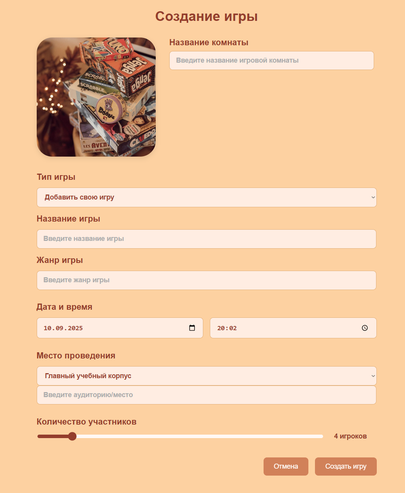

<h1 align="center">UrFU Table Games</h1>

<h3>Frontend app with mock API(localStorage)</h3>
React + Vite, JavaScript
 

<h3>use localhost deploy:</h3>
<ul>
<li>require <a href = "https://nodejs.org/en/download">NodeJS</a> and <a href = "https://babeljs.io/setup#installation">Babel</a></li>
<li>use git:<code>git clone https://github.com/kapiw0n/urfu-table-games-ls</code> to extract repo</li>
<li>install next npm packages:<ul>
  <li><code>vite@latest</code></li>
  <li><code>react-router-dom</code></li>
  </ul></li>
  <li>turn on by <code>npm run dev</code></li>
  <li>application link: <a href = "https://localhost:5173/">https://localhost:5173/</a></li>
</ul>
 

<h3 align="center">some sorta screenshots:</h3>

  
  
  
  
  

